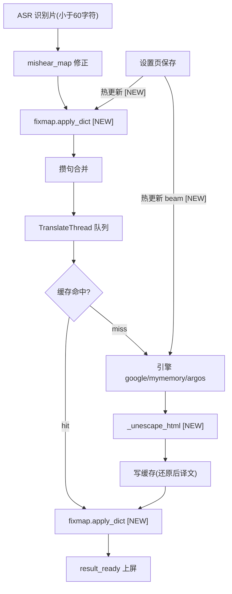
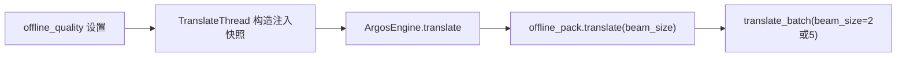

# 译文质量优化（translation-quality）技术设计

Feature Name: translation-quality
Updated: 2026-09-13

## Description

在 v2.5.3 翻译链路上实施六项译文质量优化：HTML 实体还原、修正词典语境化替换、缓存键规范化、离线质量档（beam_size 可选）、词典即时热更新、死配置清理。音频采集与 ASR 识别链路零改动，引擎备援顺序与探测逻辑零改动。

## Architecture

翻译数据流与改动点全景（标 [NEW] 为本设计新增）：



Argos 质量档参数流：



## Components and Interfaces

### 1. `app/fixmap.py`（新模块，R2 核心）

统一词典替换器，供译文侧（translator）与识别侧（asr/engine）共用。

```python
# app/fixmap.py
def apply_dict(text: str, mapping: dict, whole_word: bool = False) -> str:
    """按 键长度降序 单轮替换。拉丁词条在 whole_word=True 时加词边界。"""

def is_latin_key(key: str) -> bool:
    """纯拉丁词条判定：^[A-Za-z0-9][A-Za-z0-9 _-]*$"""
```

实现要点：
- **单轮语义**：将全部词条编译为单个 alternation 正则（`re.escape(key)`，按键长降序排列分支），`re.sub` 一次遍历完成——替换产物天然不再被同轮匹配，根除链式误替换（现状 bug：translator.py:324-326 逐条 replace）
- **词边界**：`whole_word=True` 且 `is_latin_key(key)` 时分支为 `r"\b" + re.escape(key) + r"\b"`；CJK 或开关关闭维持裸子串匹配
- **性能**：mapping 变化时才重编译，编译结果按 `id(mapping)`+长度缓存；字幕文本短（<300 字符），正则开销可忽略
- **兜底**：任一词条导致正则编译异常（理论上 re.escape 后不可能，防御性）时该词条退化为 `str.replace` 并记日志
- 空 mapping、空 key/value、空 text：直接返回原 text

### 2. `app/translate/translator.py` 改动（R1 + R2 + R3 + R4 + R5）

| 位置 | 改动 |
|------|------|
| `_do_translate`（translator.py:426-439） | 引擎返回译文后、写缓存前调用 `_unescape_html(text)`；缓存保存还原后译文，命中即所见 |
| 新增 `_unescape_html` | `html.unescape` 单次调用；try/except 包裹，异常时返回原译并 `log.warning`（R1） |
| `apply_fix_map`（translator.py:317-327） | 整体替换为 `fixmap.apply_dict(text, fix_map, self._fix_whole_word)` |
| `_cache_key`（translator.py:421-424） | text 维度改为 `text.strip()`，写入与查找共用同一规范化（R3） |
| `TranslateThread.__init__` | 新增 `beam_size` 成员（自 config `offline_quality` 映射 5/2）；新增 `self._fix_whole_word` |
| 新增 `update_fix_map(mapping)`、`update_whole_word(bool)`、`update_beam_size(int)` | 简单属性替换，QThread 跨线程赋值 Python 引用原子，无需锁（R5/R4 热更） |
| ArgosEngine 转发 | `offline_pack.translate(..., beam_size=self._beam_size)`（translator.py:278-309） |

`_unescape_html` 单层还原语义：`html.unescape("&amp;quot;")` 产 `&quot;`——双重转义自动保留一层，恰好满足 R1-AC2，无需额外代码。

### 3. `app/asr/engine.py` 改动（R2 + R5）

| 位置 | 改动 |
|------|------|
| `_postprocess`（engine.py:238-245） | `text.replace(wrong, right)` 循环替换为 `fixmap.apply_dict(text, self._mishear_map, self._mishear_whole_word)` |
| `AsrThread.__init__`（engine.py:226） | 接收 `whole_word` 快照 |
| 新增 `update_mishear_map(mapping, whole_word)` | 热更新两成员 |

应用位置保持在 whisper 拼接后、`split_long_caption` 之前（engine.py:652-653），顺序与 v2.5.3 一致。

### 4. `app/translate/offline_pack.py` 改动（R4）

- `translate(text, source, target, beam_size=2)` 增加带默认值参数，透传到 `_translate_chunk` 的 `translate_batch(beam_size=beam_size)`（offline_pack.py:381-391）
- `PackTranslator` 实例缓存（`_translator_cache`）不受影响：beam 为每次调用参数，无需重建模型实例
- 默认值 2 保持模块向后兼容

### 5. `app/config.py` 改动（R4 + R5 + R6）

```python
# 新增（DEFAULTS 白名单）
"fix_whole_word": True,          # R2：词典全词匹配，用户裁决默认开启
"offline_quality": "high",       # R4：fast=beam 2 / high=beam 5，用户裁决默认高质量
# 删除
"translate_zh_from_zh": ...,     # R6：死配置，无读取点
```

translator.py:492 的 zh→zh 回显硬编码保持不动（R6-AC3）。

### 6. `app/ui/settings_dialog.py` 改动（R2 + R4 + R5 + R6）

按 v2.3.0 声明式规约三处登记（DEFAULTS + `_FIELD_SPECS` + `_STD_ROWS`）：
- pipeline 组（settings_dialog.py:159）新增「词典全词匹配」开关，tooltip 说明"英文词条仅整词替换，中文词条始终按原文替换"
- 翻译组新增「离线翻译质量」下拉：`快速（默认更快）` / `高质量（译文更连贯，稍慢）`——文案如实标注差异（R4-AC4）；下拉默认值取 `offline_quality`
- 删除 `translate_zh_from_zh` 的 hidden 登记行（settings_dialog.py:178）
- 保存回调新增：管线运行中时调用 `main_window.apply_pipeline_hotfix()`（见下）

### 7. `app/ui/main_window.py` 改动（R5 + R4 热更入口）

新增方法 `apply_pipeline_hotfix(cfg)`，在设置保存成功且管线运行中时执行：

```python
def apply_pipeline_hotfix(self, cfg):
    self.asr_thread and self.asr_thread.update_mishear_map(cfg.mishear_map, cfg.fix_whole_word)
    self.trans_thread and self.trans_thread.update_fix_map(cfg.translate_fix_map, cfg.fix_whole_word)
    self.trans_thread and self.trans_thread.update_beam_size(5 if cfg.offline_quality == "high" else 2)
```

R5-AC3 兜底：热更方法内部 try/except，失败记日志并保持旧词典——现有"重启管线生效"路径依然完整保留（构造快照注入不动）。

## Data Models

- 新配置键：`fix_whole_word: bool`、`offline_quality: str("fast"|"high")`，均走 DEFAULTS 白名单校验
- 缓存条目结构不变（`[translated, used_lang]`）；键格式不变（`engine:target:src:text`），text 维度语义变为 strip 后——存量缓存自然淘汰（800 条 FIFO），无需迁移
- 词典数据结构不变（`{wrong: right}`），替换语义升级在应用层

## Correctness Properties

1. **单轮性**：对任意 mapping，`apply_dict` 的替换产物在当轮不再参与匹配
2. **长键优先**：同位置同时命中长短两键时，长键胜出（alternation 分支序保证）
3. **兼容性**：`whole_word=False` 且 mapping 仅含 CJK 词条时，结果与 v2.5.3 的逐条 replace 在无链式干扰场景下逐字符一致
4. **缓存一致性**：写入键与查找键使用同一 strip 规范化；缓存中的译文 = 上屏所见译文（实体已还原）
5. **实体单层性**：连续两次 `_unescape_html` 应用等价于一次（幂等），`&amp;quot;` 场景结果稳定为 `&quot;`
6. **热更新原子性**：替换 dict/成员引用为原子操作，读侧永远看到完整旧值或完整新值
7. **beam 参数封闭性**：`offline_quality` 合法值映射完备（fast→2，high→5），未知值回落 2

## Error Handling

| 场景 | 处理 |
|------|------|
| `html.unescape` 抛异常 | 返回引擎原译，`log.warning` 记录文本前 50 字符（R1-AC3） |
| 词条正则编译异常 | 该词条退化为 `str.replace`，记日志 |
| 热更新调用异常 | 捕获记日志，管线沿用旧词典继续运行（R5-AC3） |
| `offline_quality` 配置值非法 | 读侧按 fast（beam 2）处理 |
| 老配置含 `translate_zh_from_zh` | 加载静默忽略，下次保存自然清除（R6-AC2） |

## Test Strategy

**单元测试（tests/test_units.py 增补）**
- fixmap：纯拉丁词边界开/关、CJK 子串、长键优先、单轮语义（A 产物含 B 键）、空 map、大小写敏感保持、连字符与空格词条
- `_unescape_html`：`&quot;` 还原、`&amp;quot;` 保留单层、无实体透传、幂等性
- `_cache_key`：strip 前后同键命中；不同引擎不同键（回归）
- beam 映射：fast→2 / high→5 / 未知→2

**集成测试（tests/test_integration.py 增补）**
- 新配置键在 `_FIELD_SPECS` 登记且读写往返
- `update_mishear_map`/`update_fix_map`/`update_beam_size` 热更后线程内生效
- `translate_zh_from_zh` 从 DEFAULTS 移除后旧配置加载无异常
- offline_pack `translate(beam_size=5)` 参数到达 `translate_batch`

**回归基线**：既有 38 项单元 + 69 项集成全绿；改动后全量重跑比对

## References

[^1]: (File#L317-L327) app/translate/translator.py - apply_fix_map 现状（逐条 replace）
[^2]: (File#L238-L245) app/asr/engine.py - mishear_map 现状
[^3]: (File#L421-L424) app/translate/translator.py - _cache_key 现状
[^4]: (File#L381-L391) app/translate/offline_pack.py - translate_batch 调用点
[^5]: (File#L159) app/ui/settings_dialog.py - pipeline 组登记位置
[^6]: .monkeycode/specs/translation-quality/requirements.md - 已确认需求
