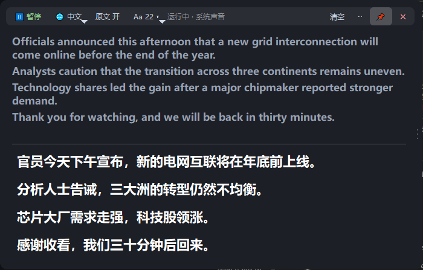
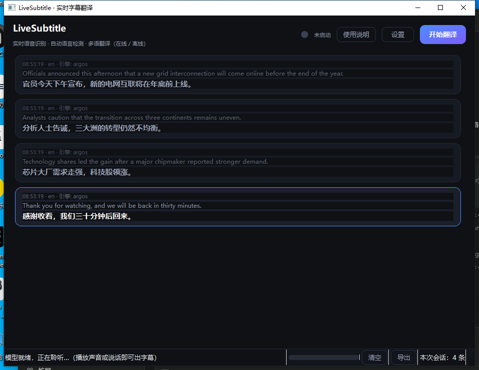
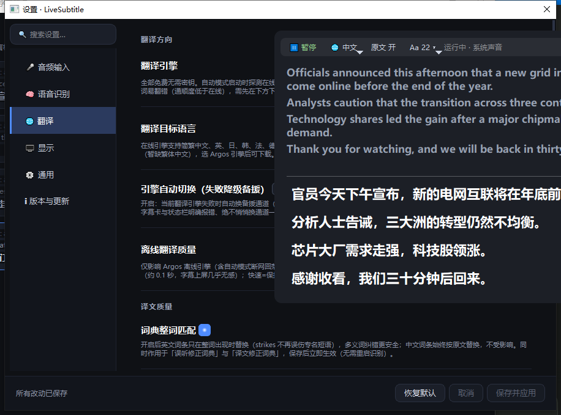

# LiveSubtitle · 实时字幕翻译

<p>
  <a href="https://github.com/2465251326-netizen/live-subtitle/releases/latest"></a>
  <a href="https://github.com/2465251326-netizen/live-subtitle/blob/main/LICENSE"></a>
  
  
</p>

> ### ⚠️ 用之前请先读这一句
>
> **本项目全程由 AI 生成（Vibe Coding），可能存在不可用的情况，或者体验上的不足。**
>
> 我是个代码小白，做这个项目首先是为了**解决自己的问题**，顺便帮助有需要的人。
> 所以请这样理解它：能跑、每天都在自己用，但**不保证适配你的机器，也不保证长期维护**。
>
> - 遇到问题不算意外——欢迎[提 Issue](https://github.com/2465251326-netizen/live-subtitle/issues/new/choose)（附上日志能大幅加快定位），也欢迎直接改代码提 PR
> - 首次使用需要联网下载识别模型（以及可选的离线语言包），之后可全程离线
> - 本项目按 **MIT 许可证** 提供，无任何担保；重要场合请先自己试一遍
>
> <sub>开发过程由 AI 完成，用到的模型来自智谱 GLM 系列与阿里通义千问（Qwen）系列。</sub>

一款 Windows 桌面实时字幕工具：**抓取电脑正在播放的声音**（或麦克风输入），本地识别语音，实时翻译成目标语言。对标 Chrome「实时字幕」，并补齐它的核心短板——**自动检测语言 + 实时翻译 + 全部参数可调**（引擎自动备援默认开着，可在设置里关掉，关掉后失败就明确报错不换通道）。在线翻译支持 16 种主流目标语言，离线语言包支持其中 15 种（暂缺繁体中文）。

## 🖼 长什么样

**悬浮字幕面板**（「上下双语」布局）：上半是逐句累积的原文，下半是译文卡片，最新一句带蓝色竖条；两栏都能滚轮回看，不显示滚动条。



**主窗口**：字幕历史卡片（时间 · 识别语言 · 引擎 + 原文 + 译文），底部是引擎状态、采集电平与「清空 / 导出 / 本次会话条数」。



**设置页**：左侧分页 + 顶部搜索；改动先暂存，点右下角「保存并应用」才生效（部分项即时生效，界面上有标注）。



## ✨ 功能亮点

- 🎧 **系统声音环回采集**：网页视频 / 播放器 / 会议的声音直接抓取，无需声卡设置；也有麦克风模式
- 🧠 **本地语音识别**（faster-whisper）：tiny → large-v3-turbo 五档，可选 GPU（CUDA）加速，**音频不出电脑**（注意：用在线翻译引擎时，识别出来的文本会发给翻译服务商；对隐私敏感请选离线语言包）
- 🌏 **实时翻译**：在线 16 语言（Google/MyMemory 备援链）+ 离线语言包 15 方向；**离线包下载好之后可全程离线**（首次下载需要联网）
- ⚡ **译文分两级上屏**：识别碎片一到就先译「目前攒到的半句」（实测约 0.2 秒出第一版），整句攒完后终版原地接管（实测中位约 4.5 秒）。需要同时开着「低延迟模式」与「攒句合并」，且仅离线 Argos 引擎下启用——在线引擎有额度与限流，逐片加发会成倍消耗
- 🪟 **悬浮字幕面板**：两种布局任选——「列表历史」（原文+译文成对滚动回看）与「上下双语」（豆包风：上原文 / 可拖分割线 / 下译文卡片，两栏逐句累积可滚轮回看）；常驻实时显示、置顶、可拖可缩、外观全可调
- ⌨️ **全局热键**：任何界面开始/停止翻译、显隐悬浮条，组合可改键
- 📤 **字幕导出**：TXT 纯文本 / SRT 时间轴（含 Whisper 真实时长与长句自动折行）
- 🧪 **质量调优**：幻觉抑制、Silero VAD、误听/译文修正词典（英文整词匹配）、离线翻译质量档、流式上屏开关
- 🆓 **完全免费**，无需任何 API 密钥（在线通道有每日额度与限流；离线语言包无额度限制）

## 📥 下载

前往 **[Releases 页面](https://github.com/2465251326-netizen/live-subtitle/releases/latest)** 下载：

| 版本 | 适合 |
|---|---|
| `LiveSubtitle-Setup-x.y.z.exe` | 安装版（开始菜单/桌面图标；更新检查在「设置-通用」里手动点「检查更新」） |
| `LiveSubtitle-x.y.z-portable.zip` | 绿色版（解压即用，不写注册表） |

## 💬 反馈

遇到问题或有建议？欢迎 **[提交 Issue](https://github.com/2465251326-netizen/live-subtitle/issues/new/choose)**，两种结构化模板任选：

- 🐞 **BUG 反馈**：版本 / 复现步骤 / 期望表现，支持拖拽上传截图；附上 `~/.live_subtitle/logs/app.log` 尾部日志可大幅加快定位
- 💡 **功能建议**：想解决什么问题 / 期望方案 / 替代做法

缺陷标 `bug`、建议标 `enhancement`，逐条回复；高频问题会沉淀进下方 FAQ。

## 📜 更新日志

版本说明见 **[Releases](https://github.com/2465251326-netizen/live-subtitle/releases)**，完整历史见 **[CHANGELOG.md](CHANGELOG.md)**。

---

## 目录

- [长什么样](#-长什么样)
- [功能亮点](#-功能亮点)
- [下载](#-下载)
- [反馈](#-反馈)
- [下载与安装](#下载与安装)
- [三分钟上手](#三分钟上手)
- [界面与功能详解](#界面与功能详解)
- [翻译引擎详解](#翻译引擎详解)
- [离线语言包](#离线语言包)
- [识别模型与速度](#识别模型与速度)
- [常见问题](#常见问题)
- [故障排查](#故障排查)
- [隐私与数据说明](#隐私与数据说明)
- [卸载说明](#卸载说明)
- [从源码构建（开发者）](#从源码构建开发者)
- [技术方案](#技术方案)
- [完整更新日志](CHANGELOG.md) · [Releases](https://github.com/2465251326-netizen/live-subtitle/releases)

---

## 下载与安装

### 系统要求

| 项目 | 要求 |
|------|------|
| 操作系统 | Windows 10 / 11（64 位） |
| 内存 | 4GB 起步，8GB 推荐（识别模型运行时约占用 0.6-1.5GB） |
| CPU | 双核可运行（tiny/base 模型），4 核以上可流畅运行 small 模型 |
| 显卡 | 无要求；有 NVIDIA 显卡可选用 GPU 加速 |
| 网络 | 在线翻译需要联网；离线模式（本地识别 + 离线语言包）全程无需网络 |

### 安装方式

**方式一：安装版（推荐）**

1. 打开本项目的 [Releases 页面](https://github.com/2465251326-netizen/live-subtitle/releases)
2. 下载最新版本的 `LiveSubtitle-Setup-x.y.z.exe`
3. 双击运行，按提示安装（可选安装路径，自动创建桌面快捷方式）
4. 安装完成后从桌面或开始菜单启动

**方式二：绿色版（免安装）**

1. 在 Releases 页面下载 `LiveSubtitle-x.y.z-portable.zip`
2. 解压到任意目录（建议路径不含中文和空格）
3. 运行目录内的 `LiveSubtitle.exe`

两种方式功能完全一致。绿色版适合免管理员权限的场景；安装版自带卸载器，便于日常使用。

---

## 三分钟上手

1. **选音频源**：点顶栏「设置」打开设置窗口，在「音频输入」页选择。看视频 / 听会议选「系统声音」，翻译别人对你说话选「麦克风」
2. **选识别模型**：保持默认 `small` 即可（首次使用会自动下载模型，约 480MB，一次性）
3. **确认翻译方向**：「翻译目标语言」默认简体中文；需要翻译成其他语言时在下拉中切换
4. **点「开始翻译」**：右上角按钮，状态点变绿即开始工作，播放视频即可看到字幕逐句出现
5. **（可选）调整悬浮字幕面板**：面板启动即常驻显示——把它的工具条拖到播放器下方合适位置即可；想临时藏一下按热键（默认 `Ctrl + Alt + O`），下次打开软件自动恢复

停止翻译再次点击右上角按钮即可。关闭主窗口时会询问「隐藏到托盘」还是「退出程序」。

---

## 界面与功能详解

### 主窗口

主窗口分为顶栏、字幕区、状态栏三部分。顶栏按钮：

| 按钮 | 作用 |
|------|------|
| 设置 | 打开独立设置窗口（分类导航式） |
| 使用说明 | 打开浏览器跳转本页 |
| 开始翻译 / 停止 | 启动或停止实时字幕 |

状态栏显示当前使用的翻译引擎、识别语言、采集音量与本次会话字幕条数，并提供「清空」按钮一键清空会话字幕。

### 设置窗口

点击顶栏「设置」按钮打开独立设置窗口（微信 PC 版风格：左侧分类导航 + 右侧内容区）。改动**暂存后点底部「保存并应用」统一生效**：管线类设置（模型 / 引擎 / 音频源）保存后自动重启管线；悬浮字幕样式支持实时预览。

左侧分五类：**音频输入 / 语音识别 / 翻译 / 显示 / 通用**。

**音频输入**

- **音频源**：「系统声音」采集电脑播放的一切声音（推荐看视频用）；「麦克风」采集外部人声
- **设备**：选择具体输入 / 输出设备；更换耳机等设备后点旁边的刷新按钮重新加载

**语音识别**

- **模型**：`tiny / base / small / medium / large-v3-turbo` 五档，体积与速度见[识别模型与速度](#识别模型与速度)。首次选择后自动下载，之后永久离线可用
- **识别语言**：「自动检测」（默认，自动锁定说话语言）或手动指定语言。已知语言时手动锁定识别更快更稳
- **计算方式**：三档——「CPU 模式（通用）」／「强制 GPU（需先装好 CUDA 运行时）」／「自动（安全档 = 优先 CPU 稳定运行）」。**要用 NVIDIA 显卡加速请选「强制 GPU」**，并在设置里先「检测 GPU 环境」；「自动」是保守档，检测不通过就走 CPU
- **推测式增量翻译**（默认开）：识别碎片一到达就先翻译「目前攒到的文本」并上屏，下一片到达时译文在同一张字幕卡上原地生长覆盖，整句攒完后终版接管——不必再干等整句。真机实测连续语流下译文出现从约 5.1 秒缩短到 0.1 秒。**仅离线 Argos 引擎生效**：在线引擎有额度与限流，逐片加发会成倍消耗，故自动保持整句翻译
- **翻译攒句合并**（默认开）：开＝识别碎片照常逐片上屏，但翻译等整句攒完再送，译文更连贯；关＝**每个识别片段一到达就立刻送去翻译**，观感最"实时"，代价是切段处译文不完整、机翻味更重、在线引擎请求量上升（离线 Argos 语言包无额度压力，建议配离线引擎）。本开关只决定"要不要攒整句"，**不改变切句节奏**（那由下面的「连续语流分段上限」与「低延迟模式」决定），保存后立即生效、无需重新开始翻译
- **连续语流分段上限**（默认 4 秒）：连续说话不停顿时的强制切段长度，六档可选（2.5 / 3 / 4 / 6 / 10 秒或跟随模式默认）。调小则字幕刷新更密，代价是句子更易被腰斩——实测 2.5 秒档有 57~71% 的句子在上限处被硬切，4 秒档只有 0~17%
- **神经 VAD 句末判定**（实验性，默认关）：用 Silero 模型判定「是否人声」来找句末停顿。突发强背景乐盖过语音、字幕明显不切句时可开启一试；实测它对稳定背景乐与能量判据持平、且句末判停反而晚约 0.7 秒，故默认关闭（详见设置页说明）

**翻译**

- **翻译引擎**：四选一，详解见[翻译引擎详解](#翻译引擎详解)
- **翻译目标语言**：在线引擎 16 种可选（简体中文、繁体中文、英语、日语、韩语、法语、德语、西班牙语、俄语、葡萄牙语、意大利语、泰语、越南语、阿拉伯语、印尼语、印地语）；离线语言包覆盖其中 15 种（暂缺繁体中文）
- **离线翻译质量**：仅影响 Argos 离线翻译（含自动模式的断网回落）。「高质量」（默认）用更宽的翻译束宽，译文更连贯、直译痕迹更少，单句离线耗时略增（约 0.1 秒，上屏几乎无感）；「快速」为旧行为、延迟最低
- **词典整词匹配**：开启后英文纠错词条只在整词出现时替换（如「strikes=罢工」不会误伤专名短语），中文词条始终按原文替换；同时作用于「误听修正词典」与「译文修正词典」，保存后立即生效、无需重启识别
- 选择 Argos 引擎时，页面出现语言包下载区，按「识别语言 → 目标语言」方向下载对应包

**显示**

- **面板常驻实时显示**：v2.20.1 起设置页**不再有「启用字幕面板」开关**——面板一打开软件就常驻显示字幕。想临时关掉：按热键（默认 `Ctrl + Alt + O`）、右键托盘图标选「显隐字幕面板」，或点面板上的 ✕；再按一次即恢复。隐藏只在当次运行内有效，下次启动一律恢复显示
- **同时显示原文**：面板内译文上方同时保留原文（面板工具条上也可一键开关）
- **面板样式**：字号 / 文字颜色 / 背景颜色 / 背景不透明度，全部即时生效
- **面板布局**：「列表历史」= 原文+译文成对的历史滚动区（默认，可回看整场）；「上下双语」= 豆包式实时翻译：上半是**逐句累积的原文**（淡色略小，随识别流式生长），下半是**逐句累积的译文卡片**（加粗大字，最新一句左侧带主题色竖条），中间那条**分割线可以上下拖**，原文栏想留多大就拖多大；两栏各自能滚轮回看说过、译过的内容（不显示滚动条）。面板 ⋯ 菜单可随时互切
- **攒句合并**（默认开，面板 ⋯ 菜单与设置页同一路）：开＝攒成整句再翻译，译文更连贯；关＝每个识别片段一到就送翻译，观感最实时。详见上方「翻译」一节
- **流式原文**（上下双语增强，默认开）：每 0.9 秒把最近 4 秒音频重识别一次，主持人讲到哪、原文跟到哪，不再等分段周期——连续语流（新闻口播）下原文延迟约 1 秒。**译文同步实时**：每拍草稿即送离线引擎翻译，译文与原文一起逐拍生长。仅 GPU 模式实际启用（CPU 自动停用）

**通用**

- **关闭行为**：点主窗口关闭按钮时询问 / 总是隐藏到托盘 / 总是退出程序
- **启动后自动开始翻译**：打开软件即自动开始识别与翻译
- **字幕最多保留条数**：超出的旧字幕自动清理，范围 50 - 500
- **清空翻译缓存**：删除本地翻译记录缓存文件（不影响其他设置）

### 悬浮字幕面板

- **常驻实时显示**：软件一打开面板即显示，无需任何唤出动作；隐藏/再显示走热键（默认 `Ctrl + Alt + O`）、托盘右键菜单「显隐字幕面板」或面板 ✕，隐藏只在当次运行内有效（下次启动恢复显示）
- **⏸ 暂停 / ▶ 开始**：工具条最左侧一键停译、一键续译，与全局热键（默认 `Ctrl + Alt + S`）、托盘「开始 / 停止翻译」是同一个开关；文案按真实运行态显示，停止期间不再采集识别
- **拖动移动**：按住顶部工具条拖动，位置自动记忆；**拖到哪就停在哪**——v2.20.1 起按用户要求移除了「贴到屏幕四向」菜单项、双击工具条贴顶/底与松手磁吸
- **调整大小**：右缘拖宽、底缘拉高（双击底缘=恢复自动贴内容高度）
- **历史滚动**：「列表历史」正文是原文+译文成对的历史滚动区；「上下双语」两栏各自逐句累积。向上滚动即暂停自动跟随、回到底部恢复。
  「上下双语」两栏**始终不显示滚动条**（滚轮回看照常）；「列表历史」只在内容超过面板高度上限（屏幕 55%）时才浮出滚动条，因为那条路要装下整场历史
- **📌 钉住**：工具条 📌 钉住=悬浮于其他程序之上；取消=面板不再压在其他窗口之上，会被别的窗口盖住（需要点穿到面板下方窗口的场景，请直接隐藏面板）
- **收起态**：面板 ⋯ 菜单 →「收起为迷你条」把面板收成一条精简字幕行（只显示最新一句），再点同处「展开为完整面板」还原
- **独立显示**：最小化或关闭主窗口（选择隐藏到托盘时）不影响面板显示

### 系统托盘与关闭行为

启动后任务栏右下角出现 LiveSubtitle 托盘图标：

- **左键单击 / 双击**：显示并激活主窗口
- **右键菜单**：显示主窗口、开始 / 停止翻译、显隐字幕面板、切换输入来源、打开设置、退出

关闭主窗口时的行为：

- **隐藏到托盘**（默认每次询问）：主窗口消失，识别与翻译在后台继续，悬浮字幕正常显示；托盘会弹出一次气泡提示
- **退出程序**：完全退出，停止一切活动
- 勾选「记住我的选择」后不再询问；如需恢复询问，删除配置文件中的 `close_action` 项，或在配置目录编辑（见[隐私与数据说明](#隐私与数据说明)）

---

## 翻译引擎详解

| 引擎 | 联网 | 是否需要 Key | 特点 |
|------|------|-------------|------|
| 自动探测（默认） | 需要 | 否 | 启动时测试各在线通道连通性（各 2.5s），自动选择可用者 |
| Google 免费接口 | 需要 | 否 | 质量最好；国内网络不可达时自动避开 |
| MyMemory | 需要 | 否 | 国内可达，有每日免费额度（超额会返回警告并自动走备援，额度以对方当日策略为准） |
| Argos 离线语言包 | 不需要 | 否 | 完全离线，隐私最佳，无额度限制 |

补充说明：

- 会话期间主引擎失败时自动降级到 MyMemory，并记住降级结果，后续请求直达备援、不再等待超时
- 相同文本命中本地持久化缓存，零网络请求、即时返回
- 识别结果是中文且目标是中文时跳过翻译直接显示，避免无意义请求
- Argos 离线翻译支持两档质量（设置-翻译-离线翻译质量）：高质量（beam=5，译文更连贯，默认）与快速（beam=2，延迟最低）；切换后下一次离线翻译即生效
- 重度使用（如整场会议、全天挂机）建议使用 Argos 离线包，不受任何在线额度约束

---

## 离线语言包

离线翻译基于 Argos OpenTech 开源模型（CTranslate2 直载），推理引擎已内置在程序中，无需安装任何额外组件。

**下载步骤**

1. 「翻译引擎」选择 **Argos 离线语言包**
2. 面板出现语言包下载区：下拉选择源语言，按钮显示「下载所选 → 目标语言 语言包」
3. 点击下载（约 80MB / 包，带进度条），完成后列表显示「已安装」

**方向说明**

离线包按「源语言 → 目标语言」方向工作，以英语为源的方向覆盖最全（英→中、英→日、英→韩、英→法、英→德等）。部分非英语方向（如日语→中文）暂无现成离线包，此时建议：目标语言保持中文 + 源语言英语场景用离线包，其余方向用在线引擎。

**下载源**

程序优先从本仓库的镜像 Release 下载语言包（`offline-packs`），失败自动回退 Argos 官方源（argos-net.com）。语言包索引同时维护 GitHub raw 与 jsdelivr 两个源，自动切换。

**安装位置**

语言包安装在 `~\.live_subtitle\argos\packs\`（即 `C:\Users\你的用户名\.live_subtitle\argos\packs\`），删除对应目录即可移除某个语言包。

---

## 识别模型与速度

| 模型 | 体积 | 单条字幕延迟 | 中文准确率 | 适合场景 |
|------|------|-------------|-----------|---------|
| tiny | 75MB | 约 2s | 差（语言易误判） | 纯英文内容 + 老旧电脑 |
| base | 145MB | 约 2.5s | 差（语言易误判） | 纯英文内容 |
| small | 480MB | 约 3s（4 核以上） | 良好 | **默认推荐** |
| medium | 1.5GB | 约 6s（需高配或 GPU） | 优秀 | 高精度需求 |
| large-v3-turbo | 1.6GB | 约 0.6s（NVIDIA GPU 实测） | 优秀 | 有独显时的最准档 |

延迟构成：切句等待（出厂默认开低延迟＝0.30 秒判停，关闭则 0.45 秒；自适应噪声底会上下浮动）+ 本地识别（Whisper 编码器固定成本为主，与句子长短关系不大）+ 翻译（离线约 0.1s，在线 0.5-2s）。

实测参考（int8 量化、语言锁定）：4 核桌面 CPU 运行 small 模型实时率约 0.5-0.8，字幕稳定跟手；双核老机器建议 tiny 或 base。

**模型下载加速（国内网络）**

模型首次下载使用 HuggingFace，程序自动探测并切换国内镜像（hf-mirror.com）。如仍较慢，可在启动前手动设置环境变量：

```bat
set HF_ENDPOINT=https://hf-mirror.com
```

模型缓存在 `~\.live_subtitle\hf\`，下载一次永久离线可用。

---

## 常见问题

**1. 开始后音量条不动，也没有字幕？**

抓错了音频设备。确认「音频输入」选择与实际发生声音的设备一致：看视频选「系统声音」并选中正在发声的输出设备；点刷新按钮重新加载设备列表。蓝牙耳机的部分虚拟输出不支持回环采集，可改连电脑扬声器验证。

**2. 字幕出现明显延迟？**

三步排查：换更小的模型（small 换 base / tiny）；关闭其他占 CPU 的程序；确认没有多个翻译重试堆积（状态栏会显示引擎切换提示）。弱机器上语言选「自动检测」时第一句需要额外几秒做语言识别，属正常现象。

**3. 翻译结果显示原文或报错？**

在线通道可能被限流或网络波动。程序会自动降级重试；若持续失败，切换到 Argos 离线语言包（需先下载对应方向包），或稍等片刻后点「停止」再「开始」重置引擎状态。

**4. 中文视频翻不出中文？**

目标语言与识别语言相同时程序直接显示原文（设计行为，避免无意义翻译）。需要「中译英」时把目标语言改为英语即可。

**5. 模型下载很慢或失败？**

程序默认已使用国内镜像。若仍失败：检查网络代理软件是否拦截了 hf-mirror.com；或按上文手动设置 `HF_ENDPOINT` 环境变量后重启程序重试。

**6. 有 NVIDIA 显卡，如何启用 GPU 加速？**

「计算方式」选 **「强制 GPU（需先装好 CUDA 运行时）」**——注意「自动」是安全档、优先 CPU，选它不会上 GPU。源码运行需先装 CUDA 版 PyTorch（或 nvidia-cublas/cudnn 独立 wheel），设置页的「检测 GPU 环境」会告诉你缺什么并可一键安装；打包版默认内置 CPU 推理，CPU 模式下 small 档已可实时。

**7. 想完全断网使用？**

可以。识别模型本地运行；翻译引擎选 Argos 并下载语言包后，整个流程（采集 → 识别 → 翻译 → 显示）全程离线。

**8. 开机后托盘图标在，主窗口不见了？**

上次关闭时选择了「隐藏到托盘」。左键或双击托盘图标即可唤出主窗口。

---

## 故障排查

程序崩溃或行为异常时，按以下步骤收集信息：

1. 查看日志文件：`~\.live_subtitle\logs\app.log`（含未捕获异常堆栈与 Qt 致命错误）
2. 删除配置重试：重命名 `~\.live_subtitle\config.json` 后重启程序（会恢复默认设置）
3. 若问题仍在，请到 [Issues 页面](https://github.com/2465251326-netizen/live-subtitle/issues) 提交，附上日志文件内容、操作系统版本与使用的模型 / 引擎设置

> ⚠️ 日志已做脱敏（v2.20.2 起对请求 URL 里的待译文本打码，v2.20.4 起连崩溃兜底日志与代理账号口令一起覆盖）。不过日志仍会记录你看过哪些句子的**时间与事件**，公开提交前扫一眼总没坏处。

---

## 隐私与数据说明

| 数据 | 位置 | 是否上传 |
|------|------|---------|
| 音频流 | 仅内存处理，不落盘 | 否 |
| 语音识别 | 本地 Whisper 模型 | 否 |
| 待翻译文本 | 内存 + 本地缓存 | 仅在用在线引擎时发送给对应翻译服务（Google / MyMemory）；离线包模式完全不联网 |
| 配置文件 | `~\.live_subtitle\config.json` | 否 |
| 识别缓存 | `~\.live_subtitle\trans_cache.json` | 否 |
| 运行日志 | `~\.live_subtitle\logs\app.log` | 否 |

使用在线翻译引擎时，待翻译的文本片段会发送给对应翻译服务商（这是在线翻译的工作原理）；对隐私有要求的场景请使用 Argos 离线语言包。

---

## 卸载说明

- **安装版**：Windows「设置 → 应用」中找到 LiveSubtitle 卸载；或使用安装目录内的卸载器
- **绿色版**：直接删除解压目录
- 卸载程序不会删除用户数据目录 `~\.live_subtitle\`（含模型缓存、语言包、配置与日志）。确认不再使用时可手动删除整个目录释放空间（模型与语言包合计可能超过 1GB）

---

## 从源码构建（开发者）

**环境**：Python 3.10 / 3.11（勾选 Add to PATH）

**方式一：直接运行**

```bat
pip install -r requirements.txt
python main.py
```

**方式二：一键生成安装程序**

```bat
build_installer.bat
```

自动完成：创建构建环境 → 安装依赖 → PyInstaller 打包 → 检测 Inno Setup（未装则通过 winget 自动安装）→ 生成 `dist\installer\LiveSubtitle-Setup-x.y.z.exe`。

**方式三：一键生成绿色版**

```bat
build_exe.bat
```

产物在 `dist\LiveSubtitle\LiveSubtitle.exe`。

**测试**

```bat
python tests\test_units.py
python scripts\smoke_test.py
```

---

## 技术方案

| 环节 | 方案 | 说明 |
|------|------|------|
| 音频捕捉 | pyaudiowpatch（WASAPI loopback） | 直接抓系统输出声音，免立体声混音设置 |
| 语音分段 | 能量 VAD（自适应噪声底） | 静音判停 0.30s（低延迟，默认）/ 0.45s；连续语流单段上限默认 4s（2.5~14s 可调） |
| 语音识别 | faster-whisper | CPU int8 即可实时；tiny / base / small / medium / large-v3-turbo 五档 |
| 在线翻译 | Google gtx + MyMemory | 双通道免 Key，自动探测与降级 |
| 离线翻译 | Argos 语言包（CTranslate2 直载） | 程序内置推理，无需 torch |
| 界面 | PySide6（Qt6） | 深色玻璃风格、分类设置窗口、悬浮字幕、系统托盘 |

**稳健性设计**

- 语言记忆不死锁：置信度不足的段落丢弃并重置检测，换语言视频无感切换
- 延迟不雪崩：识别与翻译队列有界，积压时丢最旧保最新，字幕始终贴近播放进度
- 启动不卡顿：网络探测全部异步
- 崩溃可诊断：未捕获异常与 Qt 致命错误全部写入日志

---

## 参与贡献

发现问题或功能建议请提交 [Issue](https://github.com/2465251326-netizen/live-subtitle/issues)；欢迎 Fork 后提交 Pull Request。

---

## 许可证

本项目基于 [MIT License](LICENSE) 开源发布。
